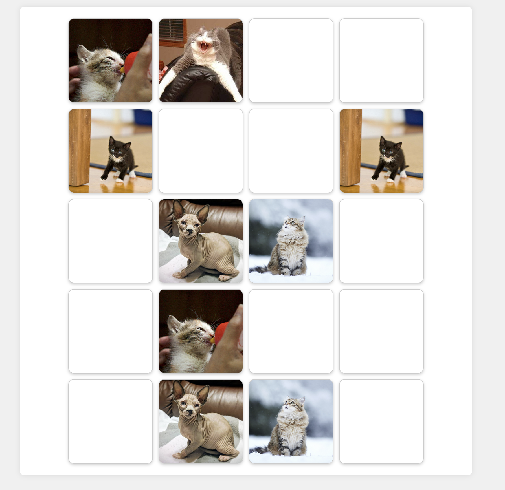

# Cat Me If You Can! 😼🐾

Welcome to Cat Me If You Can! This is a simple matching card game featuring adorable cat images. Can you match all the pairs? 😺

- [Introduction](#introduction)
- [Installation](#installation)
- [How to Play](#how-to-play)
- [Credits](#credits)

## Introduction

Cat Me If You Can! is a fun and engaging matching card game where players have to find pairs of identical cat images. It's suitable for players of all ages who love cats and enjoy casual games. 🐾

## Installation

1. Clone this repository to your local machine using `git clone`.
2. Open `index.html` in your web browser.

## How to Play

1. **Cat Card Game**: Click on cards to reveal the hidden cat images. Try to find all the matching pairs! 🃏

- Beautiful and cute cat images 😻
- 

2. **Breeds**: Click on "Breeds" in the navigation to see random cat breeds displayed on the screen.

- Random cat breeds displayed when clicking on "Breeds". 🐈‍⬛

## Credits

- 🐱 Cat images provided by [The Cat API](https://thecatapi.com/).
- 📚 Card flipping animation inspired by [w3schools](https://www.w3schools.com/howto/howto_css_flip_card.asp).
